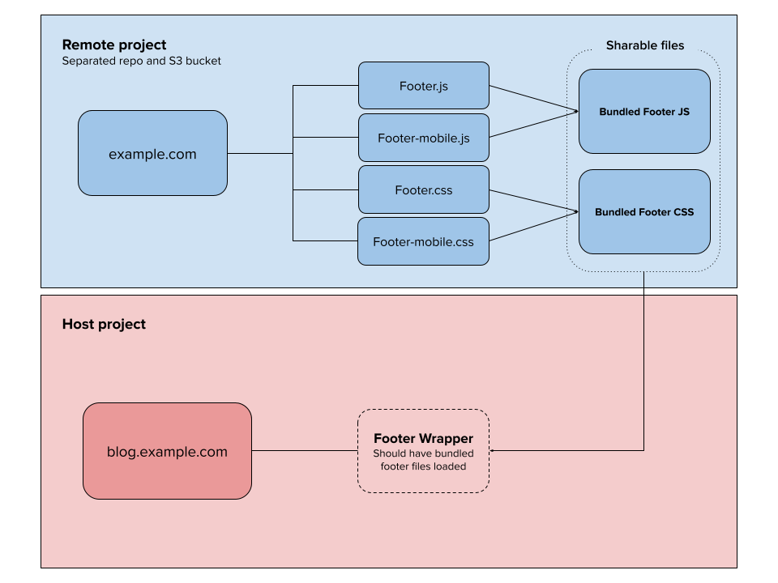

## Micro Front End approach

- Problem: Manual process to adjust files and uploading to S3
- Action: Avoid changing the file and deploying to S3 bucket manually
- Task: Manipulate files and save to a folder that could have this static file ready to be shared by other applications
- Result: no more manual file changes nor manual uploads to S3.
- A deep dive on [module federation](https://scriptedalchemy.medium.com/understanding-webpack-module-federation-a-deep-dive-efe5c55bf366)

